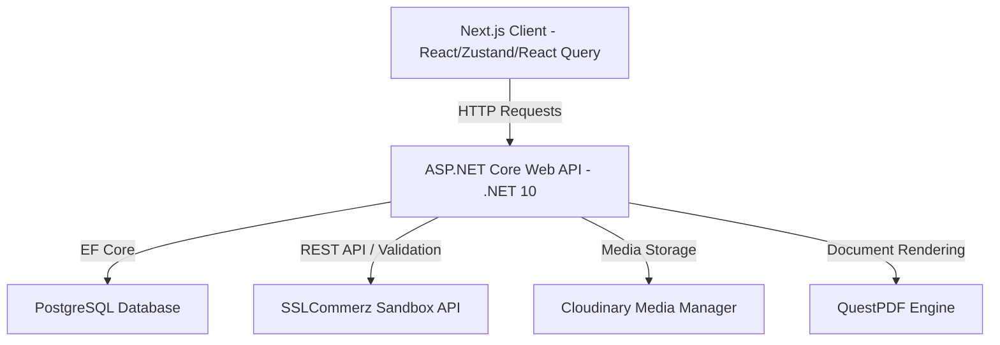
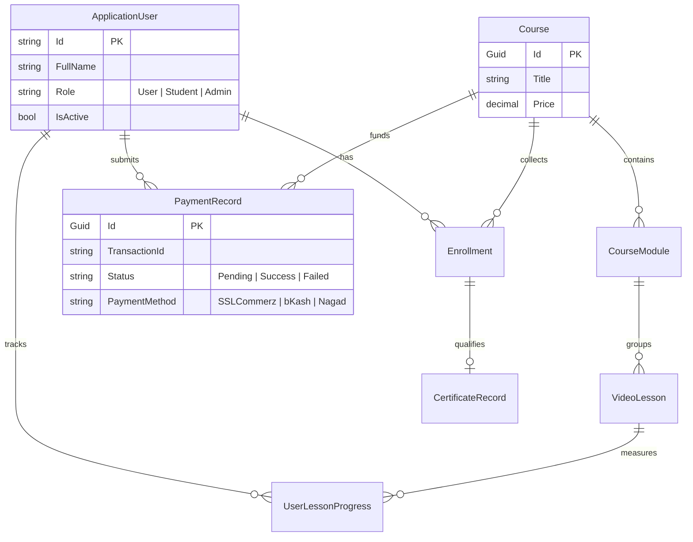

# 🎓 Victory Design & Construction Ltd (VTCLBD) — Developer Onboarding Guide

Welcome to the team! This document is designed to serve as a comprehensive architectural blueprint and onboarding walkthrough for the VTCLBD platform. 

Whether you are a fresher or a seasoned engineer joining a fast-paced environment, this guide will walk you through the system design, folder structure, API execution lifecycles, and core business components.

---

## 📌 1. Platform Overview & Business Domain

The VTCLBD platform is a dual-purpose system built for **Victory Design & Construction Ltd**:
1. **Engineering & Project Showcases**: Allows administrators to publish structural, architectural, and interior design projects to attract corporate and private clientele.
2. **Professional Training Academy**: A learning management system (LMS) where aspiring engineers and architects enroll in professional courses (AutoCAD, Revit, ETABS, Interior Design Mastery), watch structured video modules, track their learning progress, and obtain industry-recognized PDF certificates.

---

## 🛠️ 2. Technology Stack & Ecosystem



### Frontend (Client-side)
* **Core Framework**: React 19 + Next.js 15 (App Router)
* **Language**: TypeScript
* **State Management**: Zustand (for auth session persistence) + TanStack React Query v5 (for cache-heavy server state sync)
* **Styling**: Vanilla CSS custom variables & Tailwind CSS
* **Animations**: GSAP (GreenSock Animation Platform)

### Backend (Server-side)
* **Core Framework**: ASP.NET Core (.NET 10)
* **ORM**: Entity Framework Core with PostgreSQL provider
* **Document Generation**: QuestPDF (Fluent layout API)
* **Image/Video Storage**: Cloudinary API
* **Payment Gateway**: SSLCommerz Sandbox integration

---

## 📂 3. Codebase Anatomy & Folder Structures

### Backend Architecture (`/server/VTCLBD.API`)
We adhere to a clean layered design optimized for dependency injection and separation of concerns.

```
VTCLBD.API/
├── Common/
│   └── Exceptions/         # Custom exceptions mapping to HTTP status codes (ApiException, NotFoundException)
├── Configs/                # AppDbContext and Entity configurations
├── Controllers/            # API Endpoints (Auth, Course, Project, Payment, CMS, Progress)
├── DTOs/                   # Data Transfer Objects enforcing payload validation
│   ├── Auth/
│   ├── Course/
│   ├── Payment/            # Initiations, validation responses, and transaction callbacks
│   └── Progress/
├── Interfaces/             # Service contracts (IPaymentService, ICertificateService, etc.)
├── Middlewares/            # Global Exception Interceptor & CORS structures
├── Models/                 # EF Core Domain Entities (User, Course, Module, Lesson, Enrollment, PaymentRecord)
├── Services/               # Core business logic implementations
├── Program.cs              # Service containers, middleware pipelines, and CORS setup
└── appsettings.json        # Environment configuration (JWT keys, Cloudinary credentials, SSLCommerz keys)
```

### Frontend Architecture (`/client`)
Built using Next.js App Router with separated logic/service layers.

```
client/
├── app/
│   ├── (admin)/            # Admin panel dashboards and CRUD overlays
│   ├── (auth)/             # Login, Registration pages
│   ├── (dashboard)/        # Student learning dashboard and certificate viewports
│   ├── (public)/           # Public static and marketing views (Home, About, Careers, Course details)
│   └── layout.tsx          # Root layout injects Providers & Toaster
├── components/             # Reusable UI components (Navbar, Footer, VideoPlayer)
├── lib/                    # HTTP clients (Axios instance with JWT request interceptors)
├── services/               # API service layers mapping to backend controllers
├── stores/                 # Zustand global client-side state (auth.store.ts)
└── types/                  # Shared TypeScript interfaces matching backend DTO definitions
```

---

## 🗄️ 4. Database Schema & Relational Integrity

The data layer utilizes PostgreSQL. Below is the Entity-Relationship diagram highlighting how cascading deletions are handled:



> [!IMPORTANT]
> **Relational Integrity Note**: When an `ApplicationUser` is deleted by an admin via `UserService.DeleteUserAsync`, EF Core automatically triggers a cascading delete sequence. This safely cleans up all associated `Enrollments`, `PaymentRecords`, and `UserLessonProgress` logs before dropping the user record to prevent orphans.

---

## 🔌 5. Core Execution Lifecycles

### Flow A: Authentication & Session Lifecycle
```
[Client] Submit Credentials -> [AuthController.Login] -> Verify Hashed Password
                                                               │
    ┌─────────────────── Return JWT & User Payload ────────────┘
    ▼
[Zustand Store] Persist Token in localStorage
    │
    ▼ (Subsequent HTTP calls)
[Axios Interceptor] Append Bearer Token to Headers
    │
    ▼ (Token Expired)
[Axios Interceptor] Detect 401 Unauthorized -> Clear Store & Redirect to Login
```

### Flow B: Automated Course Enrollment (SSLCommerz)
Here is the step-by-step lifecycle of an online payment check-out:

```
[Client] Click "Pay & Enroll" 
   │
   ▼
[POST /api/payment/sslcommerz/initiate]
   │
   ├── 1. Generate unique Transaction ID (e.g. VTCLBD_8B3F9C7D)
   ├── 2. Save a "Pending" PaymentRecord
   ├── 3. Submit customer info & callback URLs to SSLCommerz API
   └── 4. Receive session key & Gateway Redirect Page
   │
   ▼
[Client] Redirected to Gateway -> User enters Card/Mobile credentials -> Submits
   │
   ▼
[Gateway] POST success/fail/cancel parameters to Backend Callback endpoint
   │
   ▼
[POST /api/payment/sslcommerz/callback]
   │
   ├── 1. Read Form data (tran_id, val_id)
   ├── 2. Call validator/api.php to verify signature validity
   ├── 3. If Valid: Update PaymentRecord to "Success", create "Enrollment", upgrade User to "Student"
   └── 4. Redirect Client back to Front-end dashboard: /dashboard?payment=success
```

### Flow C: Progress Tracking & QuestPDF Certificate Generation
1. When a student marks a lesson completed, the system writes to `UserLessonProgress`.
2. A database trigger/query calculates total progress. If completed lessons match the total lesson count of the course:
   * A `CertificateRecord` is automatically generated, capturing the course completion date.
3. When the user requests a PDF, `CertificateService.cs` triggers a QuestPDF generation:
   * **Slot Architecture**: Uses QuestPDF's strict page slots (`Page.Header()`, `Page.Content()`, `Page.Footer()`) within a single landscape page layout.
   * **Dynamic Details**: Draws the student's name, the course title, issues dates, and overlays the signatures along with "Victory Design & Construction Ltd" branding.

---

## 🐳 6. Deployment & CI/CD Pipelines

### Multi-stage Docker Orchestration
We run decoupled production builds via docker compose.
* **Backend Dockerfile**: A multi-stage image.
  1. `mcr.microsoft.com/dotnet/sdk:10.0` restores dependencies, runs test suites, and publishes binaries.
  2. `mcr.microsoft.com/dotnet/aspnet:10.0` (runtime base) copies the build artifacts and executes the entry point, keeping the final image footprint minimal.
* **Frontend Dockerfile**:
  1. Node.js Alpine base environment builds static assets and Next.js standalone server components.

---

## 💡 7. Mentor's Codebase Advice for New Developers

> [!TIP]
> **Debugging Local API Requests**:
> 1. To run the API locally, use `dotnet run --launch-profile http` under `/server/VTCLBD.API/`. It will listen on `http://localhost:5240`.
> 2. Ensure your local `appsettings.Development.json` values are configured correctly for JWT, Cloudinary, and SSLCommerz credentials.
> 3. Check client console logs (`localhost:3000`) for CORS blockages. CORS origins are set globally in `Program.cs` utilizing the `Cors:AllowedOrigins` configuration array.

> [!WARNING]
> **Editing Certificate Templates**:
> Avoid utilizing standard columns/height layouts when updating QuestPDF structures. Always rely on `Page.Content()` and container cells to constrain bounds. Failing to respect the boundary constraints will result in layout spills triggering unwanted secondary pages on document exports.
