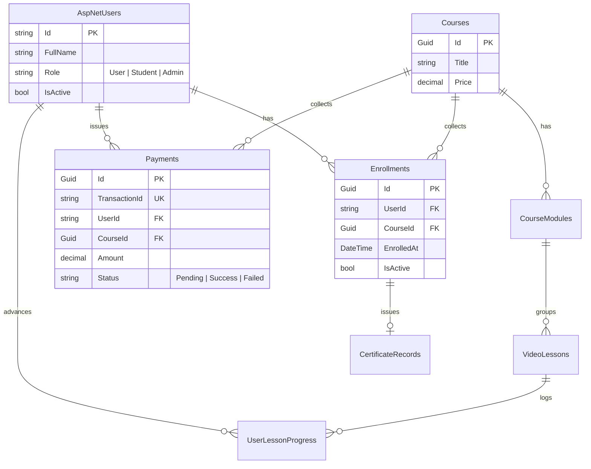

# 🏛️ Victory Design & Construction Ltd (VTCLBD) — Comprehensive System Architecture & Engineering Walkthrough

Welcome, Engineer. This is the master architectural blueprint and developer guide for the VTCLBD production-grade platform. 

This document serves as your technical mentor. It details the system design, data architecture, execution lifecycles, frontend-backend communications, testing, dockerization, and CI/CD pipelines. Let's do a deep dive into the engineering choices behind this platform.

---

## 🗺️ SECTION 1: System Design & Architectural Patterns

The VTCLBD platform is built as a highly responsive, decoupled web application. It features a stateless ASP.NET Core REST API serving a single-page React client built on Next.js.

```
┌─────────────────────────────────────────────────────────┐
│                    NEXT.JS 15 CLIENT                    │
│  (React 19, Zustand Session, React Query Cache, GSAP)   │
└────────────────────────────┬────────────────────────────┘
                             │
                             │ HTTPS REST Calls (JSON)
                             ▼
┌─────────────────────────────────────────────────────────┐
│                  ASP.NET CORE 10.0 API                  │
│   (Controllers, Domain Services, Middlewares, Filters)  │
└──────────────┬─────────────┬─────────────┬──────────────┘
               │             │             │
   EF Core 10  │             │ HTTP        │ QuestPDF
               ▼             ▼             ▼
┌──────────────┐     ┌───────┴──────┐     ┌──────────────┐
│  POSTGRESQL  │     │ SSLCOMMERZ   │     │ DYNAMIC PDF  │
│   DATABASE   │     │ SANDBOX API  │     │ CERTIFICATE  │
└──────────────┘     └──────────────┘     └──────────────┘
```

### Core Design Patterns Applied

1. **Service-Interface Pattern**: 
   * Business logic is decoupled from Controllers. Services (e.g., `PaymentService`, `CertificateService`) implement interfaces (e.g., `IPaymentService`, `ICertificateService`), which are registered via dependency injection in `Program.cs`.
   * Benefits: High testability, separation of database access/computations from HTTP endpoints.

2. **Stateless JWT Authentication**:
   * Session state is stored client-side. The backend signs a claims payload (User ID, Role, FullName) using a HMAC SHA-256 key, generating a stateless token.
   * Authorizations are checked on each request via the standard ASP.NET Core authentication middleware.

3. **Global Exception Handling Middleware**:
   * Implemented in `/server/VTCLBD.API/Middlewares/ExceptionMiddleware.cs`.
   * Any unhandled error (database deadlock, null reference, external integration timeout) is captured here, logged, and mapped to a standard `ApiResponse<T>` body with appropriate HTTP status codes (e.g., `ApiException` -> 400, `NotFoundException` -> 404).

4. **Dynamic CORS Management**:
   * Origins are injected at runtime from configuration parameters (`Cors:AllowedOrigins`), preventing cross-origin blockages when serving localhost clients or production endpoints.

---

## 🗄️ SECTION 2: Database Schema & Relational Design

The data layer runs on PostgreSQL. Relationships and cascade actions are configured inside `/server/VTCLBD.API/Configs/AppDbContext.cs`.



### Relational Cascade Policies
* **Cascade Deletes**:
  When an admin deletes an `ApplicationUser`, Entity Framework Core handles cascading deletions automatically:
  $$\text{User} \longrightarrow \text{Payments (Deleted)} \quad \text{User} \longrightarrow \text{Enrollments (Deleted)} \quad \text{User} \longrightarrow \text{Progress (Deleted)}$$
  This safeguards table integrity and prevents orphaned rows without needing raw manual database cleanup scripts.

* **Seeded Administrator & Seed Data**:
  When migrating, the platform seeds:
  * An Admin account (`admin@vtclbd.com` / `Admin@123`) assigned to the `Admin` role.
  * A Student account (`student@vtclbd.com` / `Student@123`) assigned to the `User` role.
  * Four foundational engineering courses complete with modules and lessons.

---

## ⚙️ SECTION 3: Backend File Architecture & Business Logic

Let's dissect the core backend logic, looking at function implementations and lifecycle flows.

### 3.1 SSLCommerz Payment Orchestration (`PaymentService.cs`)
This class coordinates payment initialization and callback processing. It injects `IConfiguration` to read credentials, and `IHttpClientFactory` for connection pooling.

#### Function A: `InitiateSSLCommerzPaymentAsync`
When a user chooses to enroll online, the backend requests a payment session:
```csharp
public async Task<PaymentResponseDto> InitiateSSLCommerzPaymentAsync(string userId, Guid courseId, string backendBaseUrl)
{
    var user = await _userManager.FindByIdAsync(userId);
    var course = await _context.Courses.FindAsync(courseId);
    
    // 1. Guard Clauses: Check existence and enrollment
    if (user == null) throw new NotFoundException("User not found.");
    if (course == null) throw new NotFoundException("Course not found.");
    
    var isEnrolled = await _context.Enrollments.AnyAsync(e => e.UserId == userId && e.CourseId == courseId);
    if (isEnrolled) throw new ApiException("Already enrolled.", 400);

    // 2. Generate Unique Transaction Reference
    var tranId = $"VTCLBD_{Guid.NewGuid().ToString("N").Substring(0, 12)}".ToUpper();

    // 3. Create Pending Local Payment Record
    var payment = new PaymentRecord {
        UserId = userId,
        CourseId = courseId,
        Amount = course.Price,
        Status = "Pending",
        TransactionId = tranId,
        PaymentMethod = "SSLCommerz"
    };
    _context.Payments.Add(payment);
    await _context.SaveChangesAsync();

    // 4. Fetch Gateway Configuration
    var sslSection = _configuration.GetSection("SSLCommerz");
    var storeId = sslSection["StoreId"] ?? "testbox";
    var storePassword = sslSection["StorePassword"] ?? "qwerty";
    var baseUrl = sslSection["BaseUrl"] ?? "https://sandbox.sslcommerz.com";

    // 5. Post Request Parameters to Gateway Process API
    var values = new Dictionary<string, string> {
        { "store_id", storeId },
        { "store_passwd", storePassword },
        { "total_amount", course.Price.ToString("F2") },
        { "currency", "BDT" },
        { "tran_id", tranId },
        { "success_url", $"{backendBaseUrl}/api/payment/sslcommerz/callback?status=success" },
        { "fail_url", $"{backendBaseUrl}/api/payment/sslcommerz/callback?status=fail" },
        { "cancel_url", $"{backendBaseUrl}/api/payment/sslcommerz/callback?status=cancel" },
        // Customer fields required by SSLCommerz
        { "cus_name", user.FullName ?? "Student" },
        { "cus_email", user.Email ?? "student@vtclbd.com" }
    };

    var client = _httpClientFactory.CreateClient();
    var response = await client.PostAsync($"{baseUrl}/gwprocess/v4/api.php", new FormUrlEncodedContent(values));
    var responseString = await response.Content.ReadAsStringAsync();
    
    // 6. Parse and Return Redirection Target URL
    var sslRes = JsonSerializer.Deserialize<SSLCommerzSessionResponse>(responseString, new JsonSerializerOptions { PropertyNameCaseInsensitive = true });
    return new PaymentResponseDto {
        TransactionId = tranId,
        GatewayPageURL = sslRes.GatewayPageURL
    };
}
```

#### Function B: `HandleSSLCommerzCallbackAsync`
Once the user pays, the gateway redirects them back to our API. The backend processes the callback, calling SSLCommerz's validation endpoint to verify the transaction's signature:
```csharp
public async Task<string> HandleSSLCommerzCallbackAsync(string tranId, string valId, string status)
{
    var frontendUrl = _configuration["Frontend:BaseUrl"] ?? "http://localhost:3000";
    var payment = await _context.Payments.Include(p => p.User).FirstOrDefaultAsync(p => p.TransactionId == tranId);
    
    if (payment == null) return $"{frontendUrl}/payment/failed?reason=Not Found";

    if (status == "fail" || status == "cancel") {
        payment.Status = status == "fail" ? "Failed" : "Cancelled";
        await _context.SaveChangesAsync();
        return $"{frontendUrl}/payment/failed?reason={status}";
    }

    // 1. Contact Validation Server (Security Lock)
    var sslSection = _configuration.GetSection("SSLCommerz");
    var validationUrl = $"{sslSection["BaseUrl"]}/validator/api/validationserverAPI.php?val_id={valId}&store_id={sslSection["StoreId"]}&store_passwd={sslSection["StorePassword"]}&format=json";
    
    var client = _httpClientFactory.CreateClient();
    var response = await client.GetAsync(validationUrl);
    var responseString = await response.Content.ReadAsStringAsync();
    var valRes = JsonSerializer.Deserialize<SSLCommerzValidationResponse>(responseString, new JsonSerializerOptions { PropertyNameCaseInsensitive = true });

    if (valRes == null || (valRes.Status != "VALID" && valRes.Status != "VALIDATED")) {
        payment.Status = "Failed";
        await _context.SaveChangesAsync();
        return $"{frontendUrl}/payment/failed?reason=Invalid Signature";
    }

    // 2. Complete Enrollment and Role Promotion
    payment.Status = "Success";
    _context.Enrollments.Add(new Enrollment { UserId = payment.UserId, CourseId = payment.CourseId });
    
    // Promote user if they are a standard Guest User
    var user = payment.User;
    var roles = await _userManager.GetRolesAsync(user);
    if (roles.Contains("User")) {
        await _userManager.RemoveFromRoleAsync(user, "User");
        await _userManager.AddToRoleAsync(user, "Student");
    }
    
    await _context.SaveChangesAsync();
    return $"{frontendUrl}/dashboard?payment=success&tranId={tranId}";
}
```

---

### 3.2 Landscape Document Engine (`CertificateService.cs`)
This module generates certificates dynamically on a single, full-page landscape A4 canvas using QuestPDF.

```csharp
public async Task<byte[]> GenerateCertificatePdfAsync(Guid enrollmentId)
{
    var enrollment = await _context.Enrollments
        .Include(e => e.User)
        .Include(e => e.Course)
        .FirstOrDefaultAsync(e => e.Id == enrollmentId);

    if (enrollment == null) throw new NotFoundException("Enrollment not found.");

    return Document.Create(container =>
    {
        container.Page(page =>
        {
            page.Size(PageSizes.A4.Landscape());
            page.Margin(1.5f, Unit.Centimetre);
            
            // Draw a double-line border for academic styling
            page.Content().Border(3).BorderColor("#135c7c").Padding(20).Column(col =>
            {
                col.Item().AlignCenter().Text("VICTORY DESIGN & CONSTRUCTION LTD")
                    .FontColor("#135c7c").FontSize(24).Bold().FontFamily("Inter");
                
                col.Item().Spacing(15);
                col.Item().AlignCenter().Text("CERTIFICATE OF COMPLETION").FontSize(18);
                
                col.Item().Spacing(30);
                col.Item().AlignCenter().Text("This is proudly awarded to").Italic();
                
                col.Item().Spacing(10);
                col.Item().AlignCenter().Text(enrollment.User.FullName)
                    .FontSize(28).Bold().Underline();
                
                col.Item().Spacing(20);
                col.Item().AlignCenter().Text($"for successfully completing all modules of the training").FontSize(14);
                col.Item().AlignCenter().Text(enrollment.Course.Title).FontSize(20).Bold();

                col.Item().Spacing(40);
                
                // Display issue date and signature columns side-by-side
                col.Item().Row(row =>
                {
                    row.RelativeItem().Column(c => {
                        c.Item().Text($"Date: {enrollment.EnrolledAt:dd MMMM, yyyy}").Bold();
                        c.Item().Text("Issue Date");
                    });
                    
                    row.RelativeItem().Column(c => {
                        c.Item().Text("Md. Maruf Hassan").Bold();
                        c.Item().Text("Director, Victory Design & Construction Ltd");
                    });
                });
            });
        });
    }).GeneratePdf();
}
```

---

## 💻 SECTION 4: Frontend Directory structure & Core client modules

Let's examine how the Next.js client is structured and how data flows through it.

### 4.1 Client API Gateway Interceptors (`lib/api.ts`)
This file configures Axios. It injects active JWT credentials from Zustand into the headers of outgoing requests and catches server-side token expirations:
```typescript
import axios from "axios";
import { useAuthStore } from "@/stores/auth.store";

const api = axios.create({
  baseURL: process.env.NEXT_PUBLIC_API_URL || "http://localhost:5240/api",
  headers: {
    "Content-Type": "application/json",
  },
});

// Outgoing Request Interceptor: Attach JWT
api.interceptors.request.use((config) => {
  const token = useAuthStore.getState().token;
  if (token && config.headers) {
    config.headers.Authorization = `Bearer ${token}`;
  }
  return config;
});

// Incoming Response Interceptor: Capture Session Expirations
api.interceptors.response.use(
  (response) => response,
  (error) => {
    if (error.response && error.response.status === 401) {
      // Clear client auth store and redirect
      useAuthStore.getState().logout();
      window.location.href = "/auth/login";
    }
    return Promise.reject(error);
  }
);

export default api;
```

---

### 4.2 Dynamic Payment Checkout Dialog (`courses/[id]/page.tsx`)
This page handles the course enrollment modal. It includes both automated online payment redirect logic and manual phone-number-based form processing.

```typescript
const enrollmentSchema = zod.object({
  paymentMethod: zod.enum(["bKash", "Nagad", "Bank Transfer", "SSLCommerz"]),
  phoneNumber: zod.string().optional(),
  transactionId: zod.string().optional()
}).refine((data) => {
  // If manual payment method, enforce Sender Phone validation
  if (data.paymentMethod !== "SSLCommerz") {
    return data.phoneNumber && data.phoneNumber.length >= 10;
  }
  return true;
}, {
  message: "Please enter a valid phone number (min 10 chars).",
  path: ["phoneNumber"]
}).refine((data) => {
  // If manual payment method, enforce Transaction ID validation
  if (data.paymentMethod !== "SSLCommerz") {
    return data.transactionId && data.transactionId.length >= 6;
  }
  return true;
}, {
  message: "Please enter a valid Transaction ID (min 6 chars).",
  path: ["transactionId"]
});
```

Here's how the form submit handles redirection:
```typescript
const enrollMutation = useMutation({
  mutationFn: async (formData: EnrollmentFormData) => {
    if (formData.paymentMethod === "SSLCommerz") {
      // Trigger checkout redirect session initiation
      return paymentService.initiateSSLCommerz(id);
    } else {
      // Standard manual transaction registration
      return paymentService.requestEnrollment({
        courseId: id,
        paymentMethod: formData.paymentMethod,
        phoneNumber: formData.phoneNumber ?? "",
        transactionId: formData.transactionId ?? "",
        amount: course?.price || 0
      });
    }
  },
  onSuccess: (res) => {
    if (res.data?.gatewayPageURL) {
      toast.success("Redirecting to secure gateway...");
      window.location.href = res.data.gatewayPageURL; // Redirect to external payment gateway
    } else {
      toast.success("Enrollment request submitted successfully!");
      setIsModalOpen(false);
      reset();
      router.push("/dashboard");
    }
  }
});
```

---

## 🧪 SECTION 5: Testing Architecture

### 5.1 Backend Testing (`VTCLBD.Tests`)
We write our unit tests using **xUnit**, **Moq** for mocking service dependencies, and **Microsoft.EntityFrameworkCore.InMemory** to simulate database states without hitting a live database.

```csharp
public class PaymentServiceTests
{
    private readonly AppDbContext _context;
    private readonly Mock<UserManager<ApplicationUser>> _userManagerMock;
    private readonly Mock<IConfiguration> _configMock;
    private readonly Mock<IHttpClientFactory> _clientFactoryMock;
    private readonly PaymentService _service;

    public PaymentServiceTests()
    {
        var options = new DbContextOptionsBuilder<AppDbContext>()
            .UseInMemoryDatabase(databaseName: Guid.NewGuid().ToString())
            .Options;
        _context = new AppDbContext(options);
        
        var store = new Mock<IUserStore<ApplicationUser>>();
        _userManagerMock = new Mock<UserManager<ApplicationUser>>(store.Object, null, null, null, null, null, null, null, null);
        _configMock = new Mock<IConfiguration>();
        _clientFactoryMock = new Mock<IHttpClientFactory>();

        _service = new PaymentService(_context, _userManagerMock.Object, _configMock.Object, _clientFactoryMock.Object);
    }

    [Fact]
    public async Task RequestEnrollmentAsync_ShouldThrow_WhenCourseDoesNotExist()
    {
        // Arrange
        var request = new InitiatePaymentDto { CourseId = Guid.NewGuid(), PaymentMethod = "bKash" };
        
        // Act & Assert
        await Assert.ThrowsAsync<NotFoundException>(() => 
            _service.RequestEnrollmentAsync("test-user-id", request));
    }
}
```

---

## 🐳 SECTION 6: Production Containerization & CI/CD Pipelines

To run this platform reliably across environments, we use multi-stage Docker builds.

### 6.1 Backend Production Dockerfile (`/server/VTCLBD.API/Dockerfile`)
```dockerfile
# Stage 1: Build the C# Application
FROM mcr.microsoft.com/dotnet/sdk:10.0 AS build
WORKDIR /src
COPY ["VTCLBD.API.csproj", "."]
RUN dotnet restore
COPY . .
RUN dotnet publish -c Release -o /app/publish

# Stage 2: Packaging Runtime Image
FROM mcr.microsoft.com/dotnet/aspnet:10.0 AS final
WORKDIR /app
COPY --from=build /app/publish .
ENTRYPOINT ["dotnet", "VTCLBD.API.dll"]
```

### 6.2 Frontend Production Dockerfile (`/client/Dockerfile`)
```dockerfile
# Stage 1: Install node modules and build bundle
FROM node:20-alpine AS builder
WORKDIR /app
COPY package.json yarn.lock* package-lock.json* bun.lockb* ./
RUN npm install
COPY . .
RUN npm run build

# Stage 2: Next.js Standalone Runner
FROM node:20-alpine AS runner
WORKDIR /app
ENV NODE_ENV=production
COPY --from=builder /app/public ./public
COPY --from=builder /app/.next/standalone ./
COPY --from=builder /app/.next/static ./.next/static

EXPOSE 3000
CMD ["node", "server.js"]
```

### 6.3 GitHub Actions Workflow (`.github/workflows/main.yml`)
The pipeline runs on every push to verify build and code health:
```yaml
name: VTCLBD CI Pipeline

on:
  push:
    branches: [ main ]

jobs:
  validate-solution:
    runs-on: ubuntu-latest
    steps:
    - uses: actions/checkout@v4

    # Validate C# Code Compilation
    - name: Setup .NET SDK
      uses: actions/setup-dotnet@v4
      with:
        dotnet-version: '10.0.x'
    - name: Install dependencies
      run: dotnet restore server/VTCLBD.sln
    - name: Build backend
      run: dotnet build server/VTCLBD.sln --configuration Release --no-restore

    # Validate Next.js Compilation
    - name: Setup Node.js
      uses: actions/setup-node@v4
      with:
        node-version: '20'
    - name: Build client
      run: |
        cd client
        npm install
        npm run build
```

---

## 🏁 SECTION 7: Mentor's Onboarding Playbook (Get Running in 5 mins)

Follow these steps to set up your local development environment:

1. **Verify Prerequisites**:
   * Confirm you have `.NET 10 SDK`, `Node.js 20+`, and `PostgreSQL` installed.

2. **Initialize Database**:
   * Open `/server/VTCLBD.API/appsettings.json` and configure `ConnectionStrings:DefaultConnection`.
   * Open a terminal inside `/server/VTCLBD.API/` and apply pending schema migrations:
     ```bash
     dotnet ef database update
     ```

3. **Start the API Server**:
   ```bash
   dotnet run --launch-profile http
   ```
   The API will listen at `http://localhost:5240`. You can explore the interactive API schema at `http://localhost:5240/swagger`.

4. **Launch the Frontend Client**:
   * Navigate to `/client/`
   * Install packages:
     ```bash
     npm install
     ```
   * Start the development server:
     ```bash
     npm run dev
     ```
   * Access the application at `http://localhost:3000`.

5. **Log In to Test**:
   * **Admin Access**: Email `admin@vtclbd.com` / Password `Admin@123`
   * **Student Access**: Email `student@vtclbd.com` / Password `Student@123`

---

Now, get coding! Look for open issues in `TODO.md` and check the documentation whenever you need clarification on how the services interact. Welcome to the team!
